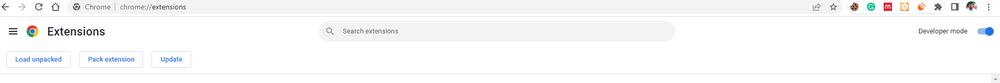

    <h1 align="center">ClipSwipe</h1>
    <h4 align="center">
      "Automatically navigate YouTube videos using keyboard shortcuts in order to Skip Adds"
    </h4>
   

<!-- Badge section -->

 <!--added redme links, just to not go elseweher -->

 

## Features
* No Content Analysis, Element Detection/Blocking or Blocking network requests etc.
* Only work locally within the user's browser to prevent ads from being played on `Youtube`. 
 

The purpose of this "ClipSwipe" ad blocker is to improve the user's watching experience by removing intrusive or unwanted advertisements. It does not involve redirecting ads to different servers or altering the ad delivery process.

## Getting started

<b>Prerequisites</b>:

* Your computer must be running on Chrome Version 114.0.5735.110 or newer
  
* Get the Latest Version of the [Extension](https://github.com/Abhijeetbyte/ClipSwipe/archive/refs/heads/main.zip)

* Extract the zip and delete unnecessary files, except `background.js` , `content.js`, `manifest.json` and `popup.html`   

* Open Google Chrome, in the address bar, enter "chrome://extensions" to open the Extensions page.

* Toggle the "Developer mode" switch located at the top-right corner of the Extensions page.
  - 

* Click on the "Load unpacked" button that appears after enabling Developer mode.

* In the file explorer window that appears, navigate to the location where you saved the "ClipSwipe" folder, select it, and click "Open". 
 

Chrome will automatically load and install your extension from the zip file. You should see the "ClipSwipe" extension appear in the list of installed extensions on the Extensions page.  

## Reporting Issues & Contributions

Feel free to report <b>[issues](https://github.com/Abhijeetbyte/ClipSwipe/issues/new)</b> and <b>contribute</b> to this repository

## License

Copyright © 2022 Abhijeet kumar. All rights reserved.

Licensed under the [CC0-1.0 License](LICENSE).
